# Lab 10 pipeline architecture

```mermaid
flowchart TD
  subgraph API[API pipeline - root Jenkinsfile]
    A0[Checkout on ephemeral Kubernetes pod] --> A1[npm ci]
    A1 --> A2{Parallel quality gates - fail fast}
    A2 --> A21[ESLint + Semgrep SAST]
    A2 --> A22[Jest unit tests + coverage]
    A2 --> A23[npm audit]
    A2 --> A24[Gitleaks]
    A21 --> A3[Sonar analysis + quality gate]
    A22 --> A3
    A23 --> A3
    A24 --> A3
    A3 --> A4[SBOM + OPA policy]
    A4 --> A5[Build and push with rootless BuildKit]
    A5 --> A6[Trivy image scan]
    A6 --> A7{Branch}
    A7 -->|develop| A8[Staging blue-green rollout + smoke test]
    A7 -->|main| A9[Pipeline Health Gate: >=90% of prior 20]
    A9 --> A10[Manual approval]
    A10 --> A11[Production blue-green rollout + smoke test]
    A8 --> A12[Email result with branch and build URL]
    A11 --> A12
    A7 -->|other| A12
  end
  subgraph Mobile[Mobile pipeline - frontend/Jenkinsfile]
    M0[Checkout on ephemeral Kubernetes pod] --> M1[flutter pub get]
    M1 --> M2{Parallel quality gates - fail fast}
    M2 --> M21[flutter analyze]
    M2 --> M22[flutter test --coverage]
    M2 --> M23[OSV SCA]
    M21 --> M3[Email result with branch and build URL]
    M22 --> M3
    M23 --> M3
  end
```

## Jenkins setup required before a real run

- Kubernetes plugin cloud: connect to the Lab 09 cluster, permit agents in `jenkins-agents`, and use service account `jenkins`. The API pod needs the `node`, `buildkit`, `trivy`, `kubectl`, `gitleaks`, and `semgrep` images to be pullable. `buildkit` requires the unprivileged user-namespace support described by the upstream rootless BuildKit setup.
- Jenkins credentials: add `sonar-token` as Secret text and `jenkins-kubeconfig` as Secret file. The latter must target the same Kubernetes cluster and namespace as the Jenkins Lab 09 setup. The local HTTP registry `registry:5000` is anonymous, so there is no registry secret in this configuration.
- Configure `PROMETHEUS_URL` in Jenkins to an HTTP endpoint reachable from the agent Pod (Lab 09 Prometheus), and `PROMETHEUS_JENKINS_JOB=taskflow-multibranch/main` if the Jenkins job has that metric label. The gate fails closed if the endpoint is absent or unreachable, fewer than 20 completed builds exist, or success rate is below 90%.
- Configure SonarQube server name `SonarQube`, NodeJS tool `node20`, Email Extension SMTP, and global default recipients (`DEFAULT_RECIPIENTS`). The Jenkins Prometheus plugin must export `default_jenkins_builds_build_result_ordinal` with `jenkins_job` and `number` labels.
- Create a multibranch API job using root `Jenkinsfile` and a separate mobile job using `frontend/Jenkinsfile`. The mobile pipeline intentionally validates and emails only; it does not create an APK/AAB, matching the requested email-only outcome.

## Scope and known limits

The Lab 10 API path now declares a dynamic Kubernetes pod and uses BuildKit/Trivy sidecars instead of Docker CLI, including on `lab10`. The older Lab 08 Terraform/Ansible branch still contains Docker-engine commands and therefore is not made Kubernetes-agent compatible by this Lab 10 change. Production has not been deployed: the live Prometheus history currently reports only 13/20 successful builds (65%), so the production gate correctly blocks it. The reviewer-assigned API/mobile feature demo and deliberate bad-change gate demonstration still require a human change, push, and Jenkins run.
