# Lab 10 CI/CD Pipeline Architecture

## Full Pipeline Architecture (Both Jenkinsfiles & Gates in Order)

```mermaid
flowchart TD
  subgraph API["Backend API Pipeline (taskflow-api - root Jenkinsfile)"]
    A0["Agent: Ephemeral Kubernetes Pod (node, buildkit, trivy, kubectl, semgrep, gitleaks)"] --> A1["Stage 2: Install Dependencies (npm ci)"]
    A1 --> A2{"Stage 3: Parallel Quality Gates (failFast: true)"}
    
    A2 --> A21["Lint (ESLint) & SAST (Semgrep)"]
    A2 --> A22["Unit Tests & Coverage (Jest)"]
    A2 --> A23["SCA (npm audit)"]
    A2 --> A24["Secrets Detection (Gitleaks)"]
    
    A21 --> A3["Stage 6: SonarQube Analysis (SonarScanner)"]
    A22 --> A3
    A23 --> A3
    A24 --> A3
    
    A3 --> A4["Gate 1: SonarQube Quality Gate (waitForQualityGate)"]
    A4 --> A5["Stage 8: Generate SBOM (CycloneDX)"]
    A5 --> A6["Gate 2: Policy Gate - OPA (security.rego eval audit.json)"]
    A6 --> A7["Stage 10: Build & Push Image (Rootless BuildKit)"]
    A7 --> A8["Gate 3: Container Security Gate (Trivy Scan - HIGH/CRITICAL)"]
    
    A8 --> ABranch{"Branch Evaluation"}
    
    ABranch -->|develop| AStaging["Stage 21: Deploy Staging (Blue/Green Rollout + Smoke Test + Auto-Rollback)"]
    ABranch -->|main| AHealth["Gate 4: Pipeline Health Gate (Prometheus >=90% Success Rate over Last 20 Builds)"]
    
    AHealth --> AApprove["Gate 5: Manual Approval Gate (Input)"]
    AApprove --> AProd["Stage 22: Deploy Production (Blue/Green Rollout + Smoke Test + Auto-Rollback)"]
    
    AStaging --> ANotif["Notifications: Email / Slack on Success & Failure (Branch + Build URL)"]
    AProd --> ANotif
    ABranch -->|feature/*| ANotif
  end

  subgraph Mobile["Mobile Pipeline (taskflow-mobile - frontend/Jenkinsfile)"]
    M0["Agent: Ephemeral Kubernetes Pod (cirruslabs/flutter:stable + osv-scanner)"] --> M1["Stage: Flutter Pub Get (enforce lockfile)"]
    M1 --> M2{"Stage: Parallel Quality Gates (failFast: true)"}
    
    M2 --> M21["Gate 1: Flutter Analyze (analyze --fatal-infos)"]
    M2 --> M22["Gate 2: Unit Tests & Coverage (flutter test --coverage)"]
    M2 --> M23["Gate 3: OSV SCA (osv-scanner)"]
    
    M21 --> M3["Stage: Build Debug APK (Every Branch)"]
    M22 --> M3
    M23 --> M3
    
    M3 --> MBranch{"Branch Evaluation"}
    MBranch -->|main| M4["Gate 4: Signed Release AAB (Android Keystore via withCredentials)"]
    MBranch -->|other| MNotif["Notifications: Email / Slack on Success & Failure (Branch + Build URL)"]
    M4 --> MNotif
  end
```

---

## Secret Management & Zero-Literal Verification

Every credential is bound dynamically via Jenkins Credentials Store (`withCredentials`):
- `sonar-token` (Secret Text)
- `jenkins-kubeconfig` (Secret File)
- `android-keystore` (Secret File), `android-keystore-password`, `android-key-alias`, `android-key-password` (Secret Text)

Running `grep -E "password|secret|token" Jenkinsfile` confirms **zero plaintext secrets/tokens/passwords** are hardcoded.

---

## Kubernetes Dynamic Agents (Lab 09) & Production Health Gate

- **Dynamic Agent Execution**: All stages run inside ephemeral Kubernetes pods spawned dynamically in `jenkins-agents` namespace and destroyed immediately after build completion.
- **Pipeline Health Gate**: Evaluates rolling success metric (`default_jenkins_builds_build_result_ordinal`) queried from Prometheus. Requires at least 20 historical builds with ≥90% success rate before permitting production blue/green rollout.
