# Lab 10 pipeline architecture

```mermaid
flowchart TD
  subgraph API[API job — root Jenkinsfile]
    A0[Checkout / secret scan] --> A1[Install]
    A1 --> A2[Lint and SAST]
    A1 --> A3[Unit tests and coverage]
    A1 --> A4[SCA / SBOM / policy / quality gates]
    A2 --> A5[E2E and image build]
    A3 --> A5
    A4 --> A5
    A5 --> A6[Image scan]
    A6 --> A7{main branch?}
    A7 -->|Yes| A8[Manual production approval]
    A8 --> A9[Pipeline Health Gate: last 20 builds >= 90%]
    A9 --> A10[Blue/green rollout and smoke check]
    A10 --> A11[Success/failure email]
    A7 -->|No| A11
  end
  subgraph Mobile[Mobile job — frontend/Jenkinsfile]
    M0[Checkout] --> M1[Flutter pub get]
    M1 --> M2[Flutter analyze]
    M1 --> M3[Flutter tests + coverage]
    M1 --> M4[OSV dependency scan]
    M2 --> M5[Flutter validation result]
    M3 --> M5
    M4 --> M5
    M5 --> M6[Success/failure email]
  end
```

## Required Jenkins setup

- Install/configure the Kubernetes and Email Extension plugins. Set SMTP and the global default recipient list used by `$DEFAULT_RECIPIENTS`.
- Create a Pipeline job for `frontend/Jenkinsfile`, using this repository's `main` branch. Keep the existing API job pointed at root `Jenkinsfile`.
- Ensure Kubernetes agents can pull `ghcr.io/cirruslabs/flutter:3.44.0` and `ghcr.io/google/osv-scanner:v2.2.2`, and permit pods in namespace `jenkins-agents` with service account `jenkins`.
- Set Jenkins environment variable `PROMETHEUS_URL` to a Prometheus endpoint reachable from the API build environment. The health gate fails closed when the endpoint is unset, unavailable, has fewer than 20 finished builds, or reports under 90% success.
- Ensure Jenkins Prometheus metrics expose `default_jenkins_builds_build_result_ordinal` with `jenkins_job` and `number` labels, and set `PROMETHEUS_JENKINS_JOB` if the metric's job label is not `taskflow-api`.

## Integration boundary

The mobile job is configured to use ephemeral Kubernetes pods and only validates Flutter code; it does not produce or publish an app package. The existing API Jenkinsfile still uses `agent any` and several host-Docker commands (`docker run --volumes-from jenkins`), so it cannot be moved to an isolated Kubernetes pod by changing its agent declaration alone. To meet the all-Kubernetes API requirement, first move those Docker/Terraform/Ansible operations to pod sidecars or Kubernetes-native tools and provide the required registry, kubeconfig, and SSH access. The Lab 10 health gate and notifications are present, but the API pipeline is not yet wholly dynamic-agent based.

The Flutter project in this workspace is `frontend/`; it is the only mobile client modified. No external mobile repository is part of this pipeline setup.
